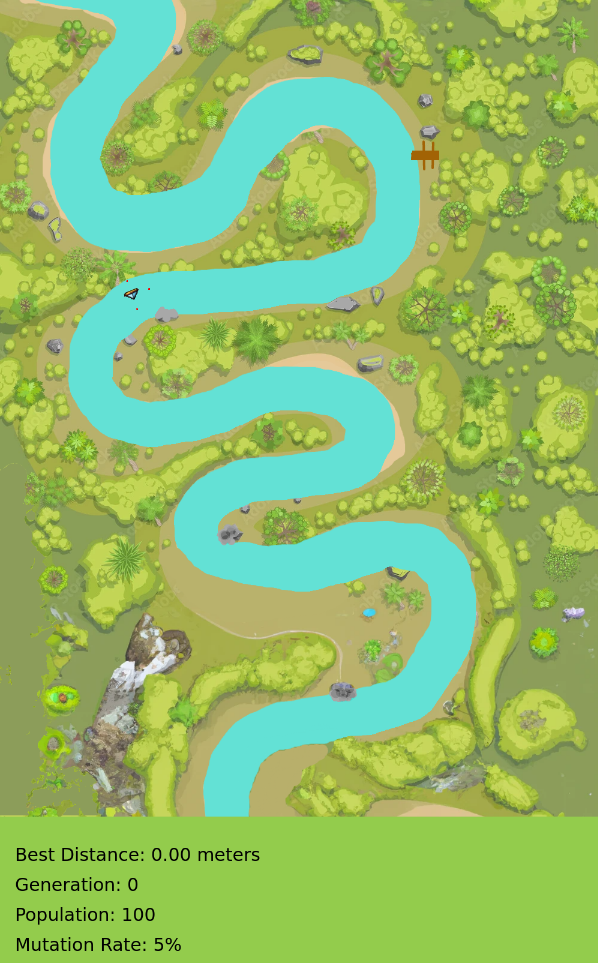

# Autonomous navigation through confined waters

Train simulated boats to navigate a waterway, save their learned behaviour as a **model**, and test it on a new route.



## Run

1. Download this project (**Code → Download ZIP**) and extract it.
2. With Python 3 installed, open a terminal in the folder containing `index.html` and run:

```sh
python3 -m http.server 8000
```

On Windows, use `py -m http.server 8000` if needed. Open [localhost:8000](http://localhost:8000), keep the terminal open, and stay connected to the internet.

Training starts automatically with 100 boats on the training track. **Generation** counts completed rounds; **Best Distance** shows the highest recorded distance among selected boats. Zoom out to see the full track. Refreshing starts training again.
If the boats keep circling,refresh.

## Save the best model (trained boat)

1. When the boats are covering substantial distance on the training track, then press **X** with the simulation window active.
2. Allow multiple downloads if prompted. Keep **`best.json`** and **`best.weights.bin`** together, with their original filenames.


## Load the saved model and test it on a different water channel

Copy both saved files into **`bestnetwork/`**, replacing the existing pair after backing it up. Or use the example model already there.

Make these two edits in **`sketch.js`**:

**1. In `preload()`, change the track line to whichever track you want:**

```js
track = loadImage('images/tracks/testing1.png');
```

**2. Uncomment the commented `setup()` function to load the best neural network and comment the `setup()` above it.**

Save this and restart the server.

To train again, restore your original `sketch.js` and refresh. **X** saves models during training only.

**Quick fixes:** If training stops with no boats visible, refresh. If saving fails, wait for a completed round and check download permissions. If loading fails, check that both model files have their original names and came from the same export.
